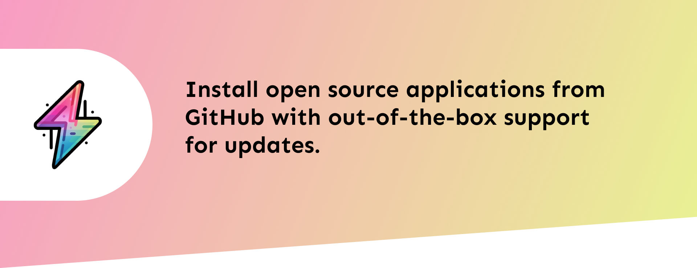

    
    <h1>Meet GPM<h1/>
    <h3>The package manager with the superpowers of cross platform build tool.<h3/>

Install your favourite open source apps now with out-of-the-box update support. Control which apps can receive updates, rollback back any app to its previous version or perform the rollback of the rollback you just did (time machine is built-in).

The Generic Package Manager enables you to distribute open source software with the ease of just a single command `gpm --install your-repo-name`, as soon as you publish your applications on GitHub, they are already available to be installed with gpm.

We use GitHub's REST API, so gpm gets your updates as soon as any other package manager gets it because gpm directly fetches your repository to check if there's new update available.

Go ahead and [install gpm](https://github.com/generic-package-manager/gpm#installation-methods) today. If you have any issues please put them in the gpm's [source repository](https://github.com/generic-package-manager/gpm/issues).

gpm itself lives on GitHub, so, have you tried installing gpm with gpm? Give it a try 😉.
